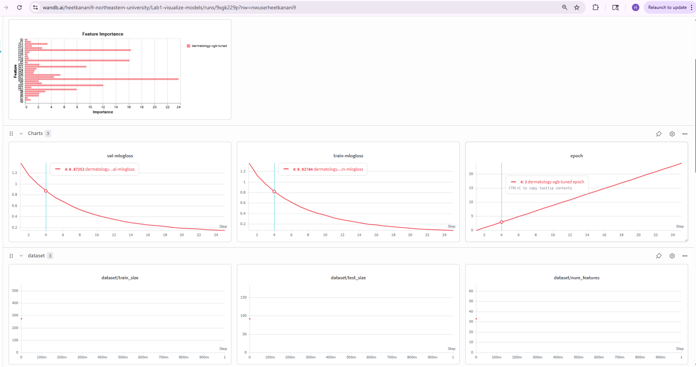
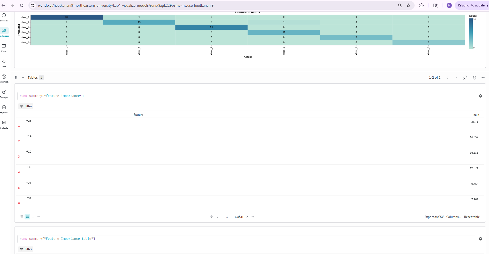
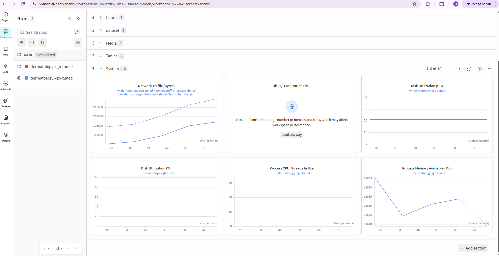

# Lab 1 - XGBoost Multi-Class Classification with W&B Tracking

Training an XGBoost classifier on the [UCI Dermatology dataset](https://archive.ics.uci.edu/ml/datasets/dermatology) to predict six skin disease classes, with full experiment tracking via [Weights & Biases](https://wandb.ai/).

## Dataset

The Dermatology dataset from UCI contains 366 samples with 33 clinical and histopathological features. Each sample belongs to one of six dermatological disease classes. Missing values in column 33 (Age) are handled by converting `?` entries to `0` during loading.

| Split    | Samples |
|----------|---------|
| Training | 274     |
| Test     | 92      |

The data is shuffled with a fixed seed (`42`) before splitting at a 75/25 ratio to avoid any ordering bias present in the raw file.

## Approach

- **Model**: XGBoost with `multi:softprob` objective (outputs class probabilities rather than hard labels)
- **Regularization**: `subsample=0.8` and `colsample_bytree=0.85` to reduce overfitting
- **Evaluation metric**: Multi-class log loss (`mlogloss`) tracked per round on both train and validation sets
- **Rounds**: 25 boosting rounds with `eta=0.15` and `max_depth=5`

### Key Hyperparameters

| Parameter          | Value            |
|--------------------|------------------|
| objective          | multi:softprob   |
| eval_metric        | mlogloss         |
| eta                | 0.15             |
| max_depth          | 5                |
| subsample          | 0.8              |
| colsample_bytree   | 0.85             |
| num_class          | 6                |
| num_rounds         | 25               |

## Results

| Metric     | Score  |
|------------|--------|
| Accuracy   | 97.83% |
| F1 Macro   | 97.81% |
| Error Rate | 2.17%  |

### Per-Class Performance

| Class   | Precision | Recall | F1-Score | Support |
|---------|-----------|--------|----------|---------|
| class_0 | 0.97      | 1.00   | 0.98     | 30      |
| class_1 | 0.93      | 0.93   | 0.93     | 14      |
| class_2 | 1.00      | 1.00   | 1.00     | 21      |
| class_3 | 1.00      | 0.92   | 0.96     | 12      |
| class_4 | 1.00      | 1.00   | 1.00     | 9       |
| class_5 | 1.00      | 1.00   | 1.00     | 6       |

## W&B Dashboard






## How to Run


1. Open a new notebook at [colab.research.google.com](https://colab.research.google.com)

2. **Cell 1** — Install dependencies:
   ```python
   !pip install wandb xgboost scikit-learn -q
   ```

3. **Cell 2** — Download the dataset:
   ```python
   !wget https://archive.ics.uci.edu/ml/machine-learning-databases/dermatology/dermatology.data -qq
   ```

4. **Cell 3** — Paste and run the training script from `Lab1.ipynb`

5. When prompted by W&B, select option `1` to create an account (or `2` to log in), then paste your API key from [wandb.ai/authorize](https://wandb.ai/authorize)

6. After the run completes, click the W&B link printed in the output to view your dashboard

## W&B Integration Summary

| What's Logged              | How                                      |
|----------------------------|------------------------------------------|
| Hyperparameters            | `wandb.config.update(params)`            |
| Train/val loss per round   | `WandbCallback()` in xgb.train           |
| Dataset size & feature count | `wandb.log()` with dataset stats       |
| Accuracy, F1, error rate   | `run.summary` final metrics              |
| Confusion matrix           | `wandb.sklearn.plot_confusion_matrix()`  |
| Feature importance table   | `wandb.Table` with gain scores           |

## Requirements

- Python 3.8+
- wandb
- xgboost
- scikit-learn
- numpy